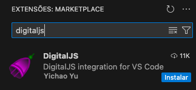
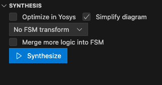
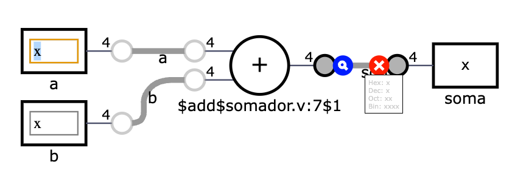
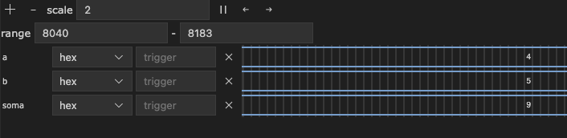

# Vamos começar simulando

!!! note "Objetivo"
    O objetivo desse laboratório é adquirir familiaridade com um circuito digital em Verilog simulando com duas ferramentas distintas: DigitalJS e Icarus Verilog.

Um mesmo circuito digital pode ser implementado de diversas formas, seja em FPGA (foco dessa disciplina), ASIC, ou mesmo com componentes discretos. Independente da forma escolhida, é sempre importante simular o circuito antes de implementá-lo. A simulação permite verificar o comportamento do circuito em diversas condições, além de permitir a depuração do código. Nesse laboratório, vamos aprender a simular circuitos digitais em Verilog utilizando duas ferramentas distintas: DigitalJS e Icarus Verilog. Ambos devem utilizar os mesmos arquivos de entrada mas possuem leves diferenças que indicaremos a seguir.

## Instalando o DigitalJS

Você pode utilizar o DigitalJS diretamente no seu navegador, sem necessidade de instalação através da versão [online do DigitalJS](https://digitaljs.tilk.eu), entretanto, para essa disciplina recomendamos utilizar um plugin do VSCode que deve ser instalado conforme imagem abaixo:



clique no botão *Instalar* e pronto. O DigitalJS estará disponível no seu VSCode. Note que o ícone da figura acima aparecerá no lado direito das abas dos editores de texto e essa é a forma mais simples de abrir um editor.

## Instalando o Icarus Verilog

O Icarus já está instalado nos computadores do IC3, entretanto, caso você queira instalar no seu computador pessoal, siga as instruções abaixo:

### Windows

1. Baixe o arquivo de instalação do [Icarus Verilog](https://bleyer.org/icarus) e instale normalmente.

2. Abra o terminal do Windows e digite `iverilog` e pressione Enter. Se o Icarus estiver instalado corretamente, você verá uma mensagem de erro indicando que nenhum arquivo de entrada foi especificado.

### Linux (Ubuntu)

1. Abra o terminal e digite `sudo apt-get install iverilog` e pressione Enter.

2. Após a instalação, digite `iverilog` e pressione Enter. Se o Icarus estiver instalado corretamente, você verá uma mensagem de erro indicando que nenhum arquivo de entrada foi especificado.

### MacOS (Homebrew)

1. Abra o terminal e digite `brew install icarus-verilog` e pressione Enter.

2. Após a instalação, digite `iverilog` e pressione Enter. Se o Icarus estiver instalado corretamente, você verá uma mensagem de erro indicando que nenhum arquivo de entrada foi especificado.

## O primeiro circuito

O [primeiro circuito](https://www.ic.unicamp.br/~rodolfo/Cursos/verilog/PrimeiroCircuito/) é baseado no tutorial indicado na bibliografia da disciplina. Recomendo uma leitura dos conceitos básicos antes de prosseguir. O circuito é um somador de 4 bits que soma dois números de 4 bits. O código em Verilog é o seguinte:

```verilog
module somador(
  input [3:0] a, // entrada de 4 bits
  input [3:0] b, // entrada de 4 bits
  output [3:0] soma // saída de 4 bits
);

  assign soma = a + b; // soma dos dois sinais de entrada

endmodule
```

### Simule no DigitalJS

Sua tarefa é simular esse circuito no DigitalJS e no Icarus Verilog. Para isso, siga os passos abaixo:

1. Aceite a primeira atividade do GitHub Classroom da disciplina. Isso criará um repositório no GitHub com o código inicial da atividade. O link para a atividade está no Google Classroom (sempre estará lá pois não posso deixar o link público).
2. Observe o circuito e o código Verilog. Tente entender o que o código faz. A linha do 'assign' está comentada. Apenas descomente-a e salve o arquivo.
3. Abra o DigitalJS no VSCode. A seguir, utilize o botão *Synthesis* conforme figura abaixo

4. Aparecerá uma janela com o circuito do somador, conforme figura abaixo. Você pode interagir com ela indicando os valores de entrada de cada um dos dois sinais ('a' e 'b'). Observe que a saída será alterada diretamente pelo circuito.

5. Na figura acima, está destacado um ponto azul, que não deve aparecer na sua tela. Esse ponto só aparece quando você move o mouse entre os sinais. Ao clicar nesse ponto azul, você automaticamente adiciona esse sinal para a forma de onda, que aparecerá abaixo na tela. A figura abaixo mostra as formas de onda do somador após adicionar os sinais 'a', 'b' e 'soma'. Observe que a saída 'soma' é a soma dos sinais 'a' e 'b'. Altere os valores e veja os sinais mudando com o tempo.


### Simule no Icarus Verilog

O processo de simulação no Icarus Verilog requer a utilização de um arquivo de teste, conforme mostrado no tutorial do primeiro circuito acima. O arquivo de testes já está incluso no repositório do GitHub. Sua tarefa é simular o circuito utilizando o Icarus Verilog e verificar se a saída é a esperada. Para isso, siga os passos abaixo:

1. Compile com o Icarus Verilog utilizando o comando: 'iverilog -o tb_somador tb_somador.v somador.v'. Esse comando utilizará os arquivos de entrada 'somador.v' que contém o código do somador e 'tb_somador.v' que contém o código de teste. Como saída, será gerado o executável 'tb_somador' (note a similaridade dessa linha com a linha de compilação do GCC).
2. Execute o arquivo gerado com o comando: './tb_somador'. Esse comando executará o arquivo gerado e mostrará a saída do circuito. Observe se a saída é a esperada.

## Entrega

Para entregar o projeto, basta fazer um *commit* no repositório do GitHub. O GitHub Classroom já está configurado para verificar a entrega e atribuir a nota automaticamente dos testes automaticamente. 

!!! note "Dica"
    Os testes do GitHub estão embutidos nos arquivos do laboratório. Se quiser saber mais sobre eles, veja o script de correção 'run.sh' do repositório do GitHub. Não altere os arquivos de correção!

!!! prazo "Data de entrega"
    A data de entrega será até dia 06/03.