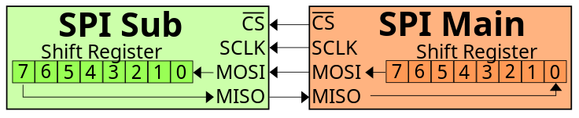
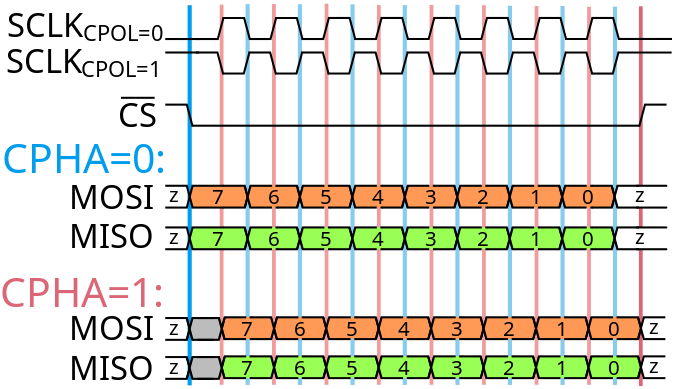

# Comunicação entre dois módulos através do protocolo SPI

!!! note "Objetivos"
    Praticar a implementação de circuitos sequenciais e compreender a comunicação através do protocolo SPI.

## Introdução e Conceitos

O protocolo SPI (Serial Peripheral Interface) é um protocolo de comunicação serial síncrono que permite a comunicação entre um microcontrolador e dispositivos periféricos. O protocolo SPI é amplamente utilizado em sistemas embarcados para a comunicação entre microcontroladores e dispositivos como sensores, displays, memórias, entre outros. Há um [artigo](https://en.wikipedia.org/wiki/Serial_Peripheral_Interface) bem interessante sobre ele na Wikipedia.

!!! note "Nomenclaturas"
    Ao procurar por SPI, você pode encontrar referências a *Master* e *Slave*. No contexto de sistemas embarcados, *Master* é o dispositivo que controla a comunicação e *Slave* é o dispositivo que é controlado pelo *Master*. Essa nomenclatura tem sido alterada para *Main* e *Sub* ao longo do tempo mas ainda é comum encontrar a referência original. Enquanto os nomes em inglês estão em transição, as traduções para o português ainda são preliminares. Nesse texto vamos utilizar as traduções como *Principal* e *Secundário*. Observe que as trocas de nomes em inglês procuraram preservar os acrônimos dos sinais que serão utilizados.

Nessa atividade, estamos simplificando um pouco o protocolo para evitar alguns casos de contorno que não são necessários no momento.

### Interconexão e pinagem

O protocolo SPI é um protocolo de comunicação full-duplex, ou seja, permite a comunicação bidirecional entre o microcontrolador e o dispositivo periférico. O protocolo SPI utiliza quatro linhas de comunicação:

- **MOSI (Main Out Sub In)**: linha de comunicação de dados do Principal para o Secundário.
- **MISO (Main In Sub Out)**: linha de comunicação de dados do Secundário para o Principal.
- **SCK (Serial Clock)**: linha de comunicação de clock.
- **CS (Chip Select)**: linha de seleção do Secundário, ativo em 0. O circuito só funciona quanto CS == 0. 

O protocolo SPI utiliza um componente Principal e um ou mais Secundários. O principal é o dispositivo que controla a comunicação e o secundário é o dispositivo que é controlado pelo principal. O principal é responsável por gerar o clock de comunicação e controlar a seleção do secundário. O secundário é responsável por receber os dados do principal e enviar os dados para o principal.

Nessa atividade, focaremos na comunicação entre dois dispositivos. A figura abaixo indica como deve ser feita a interconexão entre dois dispositivos por SPI. Note a presença de um registrador de deslocamento dentro de cada componente para realizar a conversão paralelo serial e vice-versa.



### Temporização

A próxima figura indica a temporização para uma transmissão. É importante destacar que, para garantir a integridade do sinal, há uma defasagem de meio ciclo de clock entre a geração do sinal pelo Principal e a leitura do valor pelo Secundário, com isso permitindo melhor sincronização entre os dispositivos.



A figura ilustra duas alternativas de transmissão, estamos interessados na CPHA=1, onde os bits são transmitidos na subida do clock e são lidos no dispositivo secundário na descida do clock. Seguindo a linha vermelha, vemos tanto o MOSI quanto MISO alterando os valores sempre ao mesmo momento e o componente oposto deve ler essa informação meio ciclo de clock depois.

### Um pouco sobre clock

O clock é um sinal que é utilizado para sincronizar a comunicação entre os dispositivos. O sinal de clock tem uma oscilação em intervalo constante de tempo, que é determinado pela frequência do clock. A frequência do clock é medida em Hertz (Hz) e indica a quantidade de oscilações por segundo. A frequência do clock é um dos principais fatores que determina a velocidade de comunicação entre os dispositivos.

O SPI é um dos poucos protocolos que transmitem o clock como um dos sinais e, por causa disso, gera uma restrição de distância máxima que o sinal pode percorrer. O caso mais comum é utilizar o clock dos dois componentes remotos sem sincronização explícita entre eles, permitindo maior distância mas tornando o circuito um pouco mais complexo.

### Transmissão

A transmissão de dados no protocolo SPI é feita de forma serial, ou seja, um bit por vez. A transmissão de dados é feita de forma simultânea nas duas direções sempre que possível (Principal para secundário e secundário para principal). A transmissão de dados é feita de forma síncrona, sendo controlada por um sinal de clock gerado. Suponto a transmissão de bytes em sequência, o primeiro bit a ser transmitido será sempre o bit 7 do byte.

### Sincronização entre componentes

Os componentes de um circuito, nesse nosso caso de hoje, possuem acesso ao mesmo sinal de clock ou variações dele mas que tem exatamente a mesma frequência e fase. Nesse sentido, toda vez que um sinal é enviado de um componente para o outro, ele poderá ser lido na próxima transição de clock observada (subida ou descida) conforme desejo do projetista. Isso permite que os componentes possam se comunicar de forma síncrona, ou seja, um componente pode enviar um sinal e esperar que o outro o receba na próxima transição de clock. Além dessa transmissão, no nosso caso, há um controle de mais alto nível para poder garantir que os bytes (8 bits) sejam transmitidos sempre e que haja sempre dados para transmissão ou recepção. Assim, é importante que os componentes avisem ao circuito que os controla que há espaço para começar a transmitir novos bytes, permitindo que novos bytes sejam carregados e que os valores recebidos pela comunicação serial sejam lidos. Esses sinais auxiliares serão chamados de `load`, `ready` e `done` e serão utilizados para controlar a comunicação entre os componentes. O sinal `ready` indica que o componente recebeu da linha serial todos os dados e que o valor do byte de saída é válido. O sinal `done` indica que o componente transmitiu os dados pela linha serial e que está pronto para receber novos dados. Já o sinal `load` indica que o componente deve carregar os dados de entrada e começar a transmitir pela linha serial. A temporização relativa desses sinais é relevante para permitir que as transmissões de múltiplos bytes ocorram sem intervalos entre eles. Note que um simples intervalo de um ciclo entre dois bytes faz com que se gaste 12,5% a mais de tempo para transmitir o conjunto total de dados.

## Atividades

Nessa atividade, vamos desenvolver tanto o componente Principal quanto o componente Secundário. O componente Principal será responsável por controlar a comunicação e o componente Secundário será responsável por receber os dados do Principal e enviar os dados para o Principal. Para isso, alguns sub-componentes serão necessários:

!!! task "Tarefa 1"
    Implemente um registrador de deslocamento com entrada paralela e saída serial de 8 bits. Você deve começar transmitindo sempre pelo bit mais significativo (bit 7). O registrador deve ser implementado em Verilog e simulado no DigitalJS e no Icarus Verilog. Faça um testbench para esse circuito testando valores de entrada e saída. 

A interface do módulo deve ser (caso precise, pode remover ou acrescentar `reg` aos sinais de saída):

```verilog
module sr_p2s ( // shift register, parallel to serial
    input clk,
    input reset,
    input [7:0] data_in,
    input load,
    output reg data_out,
    output reg done
);
```

Os sinais devem ter os seguintes significados:

|Sinal|Significado|
|-----|-----------|
|clk  |Sinal de clock. Seu circuito deve atuar apenas nas subidas de clock|
|reset|Sinal de reset síncrono. O circuito deve ir para o estado inicial quando esse sinal for 1|
|data_in|Sinal de 8 bits que servirá de entrada para seu circuito e deverá ser lido apenas quando o sinal de 'load' for 1|
|load|Sinal de controle que indica que o registrador deve carregar os dados do data_in e começar a transmitir os bits|
|data_out|Sinal de 1 bit que servirá de saída para seu circuito|
|done|Sinal de controle que indica que data_in foi lido. Seu circuito deve ativa-lo antes do final da transmissão para que seja possível transmitir outro byte em sequência.|


!!! task "Tarefa 2"
    Implemente um registrador de deslocamento com entrada serial e saída paralela de 8 bits. De forma análoga ao transmissor, o primeiro bit recebido será o mais significativo. O registrador deve ser implementado em Verilog e simulado no DigitalJS e no Icarus Verilog. Faça um testbench para esse circuito testando valores de entrada e saída.

A interface do módulo deve ser (caso precise, pode remover ou acrescentar `reg` aos sinais de saída):

```verilog
module sr_s2p ( // shift register, serial to parallel
    input clk,
    input reset,
    input data_in,
    input enable,
    output reg [7:0] data_out,
    output reg ready
);
```

Os sinais devem ter os seguintes significados:

|Sinal|Significado|
|-----|-----------|
|clk  |Sinal de clock. Seu circuito deve atuar apenas nas subidas de clock|
|reset|Sinal de reset síncrono. O circuito deve ir para o estado inicial quando esse sinal for 1|
|data_in|Sinal de 1 bit que servirá de entrada para seu circuito. Lembre-se que o transmissor começou a transmitir pelo bit mais significativo, então, você pode ler esse valor como bit menos significativo e, sucessivamente, desloca-lo para a esquerda a cada novo bit|
|enable|Sinal de controle que indica que o registrador deve aceitar novos bits de data_in|
|data_out|Sinal de 8 bits que servirá de saída para seu circuito|
|ready|Sinal de status que indica que todos os bits já foram recebidos. Seu circuito deve ativa-lo no momento em que estiver com o valor válido em data_out e apenas por um ciclo|

### Implementação da Interface SPI

Agora que você entendeu o básico de comunicação implementando os dois componentes implementados acima, você pode montar um componente SPI Principal e um SPI Secundário como as próximas duas tarefas que serão entregues juntas no GitHub Classroom.

!!! task "Tarefa 3"
    Implemente um componente SPI Principal. O circuito deve ser implementado em Verilog e simulado no DigitalJS e no Icarus Verilog. Essa tarefa será entregue no Github Classroom junto com a tarefa 4.

A interface do módulo deve ser (caso precise, pode remover ou acrescentar `reg` aos sinais de saída):

```verilog
module spi_main (
    input clk,
    input reset,
    input [7:0] data_in,
    input load,
    output reg [7:0] data_out,
    output reg ready,
    output reg done,
    output reg mosi,
    input miso,
    output sclk,
    output cs
);
```

Os sinais devem ter os seguintes significados (note que existem duas interfaces seriais embutidas num único componente, uma de envio e outra de recepção de dados):

|Sinal|Significado|
|-----|-----------|
|clk  |Sinal de clock. Seu circuito deve atuar apenas nas subidas de clock|
|reset|Sinal de reset síncrono. O circuito deve ir para o estado inicial quando esse sinal for 1|
|data_in|Sinal de 8 bits que servirá de entrada para seu circuito e deverá ser lido apenas quando o sinal de 'load' for 1|
|load|Sinal de controle que indica que o registrador deve carregar os dados do data_in e começar a transmitir os bits|
|data_out|Sinal de 8 bits que servirá de saída para seu circuito|
|ready|Sinal de status que indica que todos os bits já foram recebidos. Seu circuito deve ativa-lo no momento em que estiver com o valor válido em data_out e apenas por um ciclo|
|done|Sinal de controle que indica que data_in foi lido. Seu circuito deve ativa-lo antes do final da transmissão para que seja possível transmitir outro byte em sequência. Sugestão: copie o dado da entrada para um registrador interno o mais cedo possível e utilize esse registrador interno para gerenciar o registrador de deslocamento|
|mosi|Sinal de 1 bit que servirá de saída para seu circuito em direção ao componente secundário|
|miso|Sinal de 1 bit que servirá de entrada para seu circuito vindo do componente secundário|
|sclk|Sinal de clock que será transferido para o componente secundário|
|cs|Sinal de controle que indica que o componente secundário deve aceitar os dados. Deve ser ativo em zero|


!!! task "Tarefa 4"
    Implemente um componente SPI Secundário. O circuito deve ser implementado em Verilog e simulado no DigitalJS e no Icarus Verilog. Essa tarefa será entregue no Github Classroom.

A interface do módulo deve ser (caso precise, pode remover ou acrescentar `reg` aos sinais de saída):

```verilog
module spi_sub (
    input reset,
    input [7:0] data_in,
    input load,
    output reg [7:0] data_out,
    output reg ready,
    output reg done,
    input mosi,
    output reg miso,
    input sclk,
    input cs
);
```

Os sinais devem ter os seguintes significados (note que existem duas interfaces seriais embutidas num único componente, uma de envio e outra de recepção de dados):

|Sinal|Significado|
|-----|-----------|
|reset|Sinal de reset síncrono. O circuito deve ir para o estado inicial quando esse sinal for 1|
|data_in|Sinal de 8 bits que servirá de entrada para seu circuito e deverá ser lido apenas quando o sinal de 'load' for 1|
|load|Sinal de controle que indica que o registrador deve carregar os dados do data_in e começar a transmitir os bits|
|data_out|Sinal de 8 bits que servirá de saída para seu circuito|
|ready|Sinal de status que indica que todos os bits já foram recebidos. Seu circuito deve ativa-lo no momento em que estiver com o valor válido em data_out e apenas por um ciclo|
|done|Sinal de controle que indica que data_in foi lido. Seu circuito deve ativa-lo antes do final da transmissão para que seja possível transmitir outro byte em sequência|
|mosi|Sinal de 1 bit que servirá de entrada para seu circuito vindo do componente principal|
|miso|Sinal de 1 bit que servirá de saída para seu circuito em direção ao componente principal|
|sclk|Sinal de clock do circuito, que veio do componente Principal. Você deve trabalhar na borda de descida do clock.|
|cs|Sinal de controle que indica quando o componente Secundário deve trabalhar. Deve ser ativo em zero. Quando estiver com valor 1, o componente não faz nada|

!!! note "Conclusão"
    Nessa tarefa, você aprendeu sobre serialização e desserialização de dados, além de ter estudado e implementado o protocolo SPI em dois componentes.

!!! prazo "Data de entrega"
    A data de entrega será até dia 20/03.