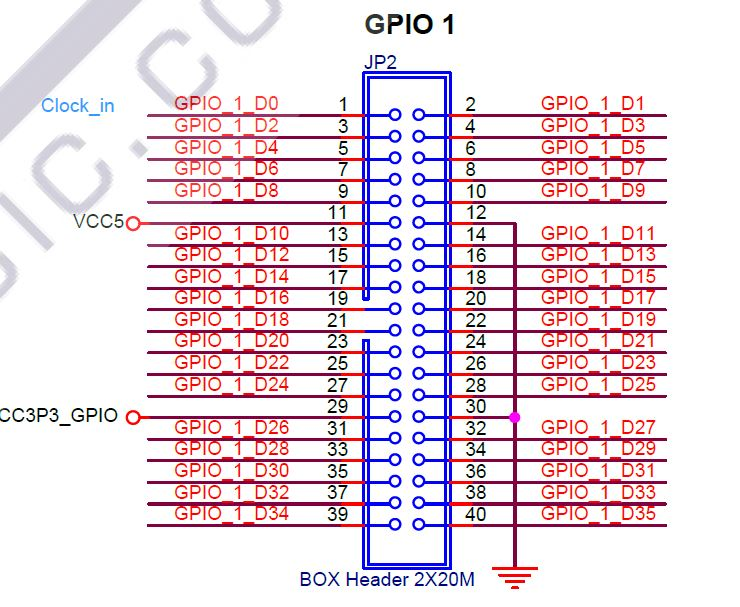

# Atividade 7

!!! note "Objetivo"
    O objetivo dessa atividade será capturar imagens continuamente de uma câmera e mostrar na tela. Para isso, você precisará se comunicar com uma câmera externa e com o monitor VGA

## Introdução

Esse laboratório requer um pouco mais de atenção em alguns aspectos: conexão física com dispositivos externos, ajuste de frequência para compatibilidade entre os componentes e memória intermediária.

## A Câmera OV7670

A câmera OV7670 é uma câmera VGA que pode ser conectada ao seu kit FPGA para capturar imagens. A câmera é capaz de capturar imagens em VGA (640x480) e enviar através de um barramento paralelo. A câmera é capaz de capturar imagens em preto e branco ou coloridas, dependendo da configuração. Nesse laboratório, para simplificar, utilize imagens em escala de cinza. Comece consultando o [datasheet da câmera OV7670](OV7670_2006.pdf) para entender como a câmera funciona. Você também pode consultar a [especificação do protocolo de comunicação](SCCB-specification.pdf).

## Pinagem do módulo de extensão da FPGA

A placa de desenvolvimento que você está utilizando possui um módulo de extensão que permite a conexão de uma câmera VGA. A pinagem do módulo de extensão é a seguinte:

você também pode consultar mais detalhes sobre a pinagem e comunicação no manual da placa de desenvolvimento. Ou um [link alternativo para essa parte](https://terasic.yubacollegecompsci.com/GPIO.html).

## Informações extras

Você deve precisar gerar um clock de 24MHz no seu projeto, para isso recomendo que utilize um [PLL](pll.md) para gerar o clock necessário.

Você também pode querer usar o SignalTap para depurar o seu projeto. O SignalTap é uma ferramenta de depuração que permite monitorar sinais internos do FPGA em tempo real. Você pode encontrar um tutorial de como utilizar o [SignalTap](https://www.youtube.com/watch?v=vsEXs5insJI&ab_channel=RaniaHussein). O ciclo de depuração com o SignalTap pode ser longo, então planeje com antecedência.

Você pode coletar facilmente a imagem em escala de cinza ao utilizar a codificação YCbCr. A componente Y é a componente de luminância, que é a imagem em tons de cinza. A componente Cb e Cr são as componentes de crominância, que são as componentes de cor. Para converter a imagem para tons de cinza, você pode simplesmente ignorar as componentes Cb e Cr.

Como você está trabalhando com dois barramentos diferentes, você pode precisar de uma memória intermediária para armazenar os dados da câmera antes de enviar para o monitor VGA. Você pode utilizar uma memória RAM para isso. Sugiro que essa memória seja um componente separado do seu projeto e apenas instanciado no arquivo de alto nível. Alternativamente, você também pode utilizar o componente RAM 2-PORT da biblioteca de IPs do Quartus. A ideia de 2 portas é que você pode escrever nela através de uma porta que recebe os dados da câmera e ler através de outra que mandará os dados para o controlador de vídeo.

Esse circuito de memória intermediária pode ser visto como um *framebuffer*, que já falamos anteriormente. Como os dois componentes estão em velocidades diferentes, você pode ver o efeito de *tearing* na imagem. O *tearing* é um efeito visual que ocorre quando a imagem é atualizada em partes, ao invés de ser atualizada inteira de uma vez. Para evitar esse efeito, você pode utilizar um buffer duplo ou triplo, que são técnicas de buffering que permitem que a imagem seja atualizada de forma mais suave (não precisa fazer esse buffer nessa atividade).

## O que fazer

!!! task "Tarefa 1"
    Implemente um circuito que capture imagens continuamente da câmera e mostre na saída VGA considerando a configuração de tons de cinza. O arquivo de alto nível deve ser o `top1.v`.

## Entrega

O código deve ser entregue no GitHub Classroom. O código deve ser entregue até o dia 15/05 até as 15h.
