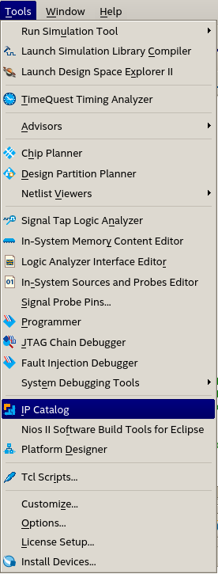
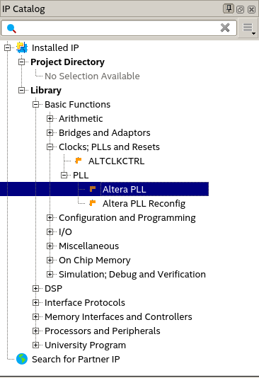
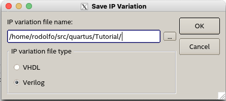
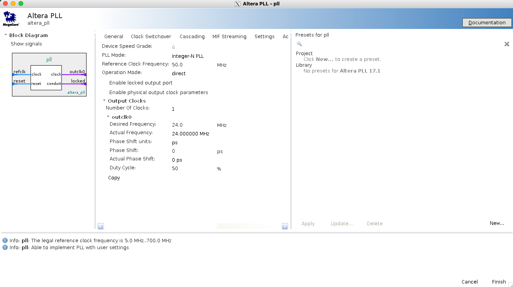
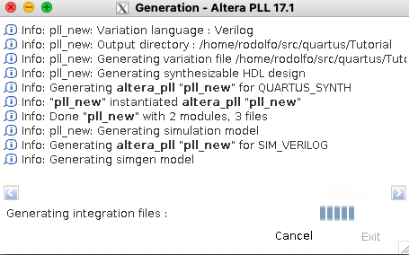

# Tutorial de Configuração de PLL no Quartus

PLL (Phase-Locked Loop) é um bloco muito importante em projetos de FPGA, responsável por gerar os sinais de clock necessários para o funcionamento do projeto. Neste tutorial, vamos aprender a configurar um PLL no Quartus.

## Um tutorial em vídeo

Esse [tutorial em vídeo](https://www.youtube.com/watch?v=NdHlpx67G7o) utiliza outra versão do Quartus mas segue passos que são semelhantes ao que você tem que fazer. No tutorial, é utilizado o clock base de 50MHz da placa para gerar dois clocks por PLL, um de 25MHz e outro de 150MHz. Você pode gerar apenas um clock se necessário.

## Passo a passo com imagens

O Quartus tem um módulo de catálogo de IP (componentes de hardware) onde um deles é o PLL que desejamos configurar. Para acessá-lo, vá em `Tools` -> `IP Catalog`, conforme figura abaixo.

Na janela que abrir, você pode tanto digitar `pll` na barra de busca ou selecionar `Library` -> `Basic Functions` -> `Clocks; PLLs and Resets` -> `PLL` -> `Altera PLL`, conforme figura abaixo. Dê dois clicks para abrir a janela de configuração.

Inicialmente será aberta uma tela para indicar o arquivo que você deseja salvar o IP. Normalmente você pode dar o nome `pll.v` (fique à vontade para escolher outro nome), clique em `OK`.

Logo em sequência, será aberta a janela de configuração do PLL. Nela, você pode configurar os parâmetros do PLL conforme a necessidade do seu projeto. Na figura abaixo, foi utilizado um clock de referência de 50MHz (clock da placa que estamos utilizando até agora) para gerar um clock de 24MHz que é o clock desejado. Conforme o tutorial em vídeo, você pode gerar mais de um clock se assim desejar.  Após concluir os parâmetros desses 2 itens, clique em `Finish` no canto inferior direito. *Infelizmente a qualidade dessa imagem não está boa, mas você também pode ver a configuração no vídeo.*

Após encerrar os parâmetros, será mostrada a tela abaixo para completar a criação dos arquivos.

Você pode utilizar os arquivos gerados para criar o clock de 24MHz necessário do exemplo.
