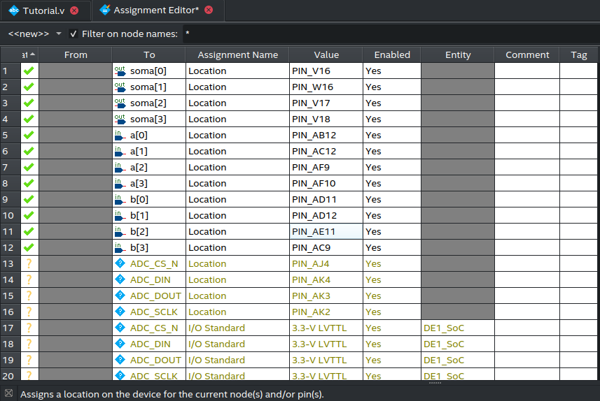

# Tutorial de Programação de FPGA com Intel® Quartus®

Este tutorial foi criado tendo em mente as necessidades específicas deste oferecimento da disciplina de MC613. Em particular, usaremos o software Quartus apenas para sintetizar o circuito e programar a placa DE1-SoC. Para outras atividades, como escrita do código e simulação, serão utilizadas outras ferramentas.

## Criar e configurar um novo projeto

Ao abrir o Quartus, você irá se deparar com a tela inicial; clique em `New Project Wizard` para criar um novo projeto.


Na janela de introdução, apenas clique em `Next`.


Cada projeto requer uma pasta separada, portanto recomenda-se organizar as pastas dos projetos dentro de uma outra pasta. Não se esqueça de dar um nome para o projeto. Atente-se também ao nome da entidade `top-level`, que é o módulo principal do seu código Verilog que contém todos os componentes e as portas de entrada e saída que serão conectadas na placa.


Na tela seguinte, selecione `Empty project` e clique em `Next`.


Nessa tela é possível adicionar todos os arquivos Verilog que você criou no VSCode e simulou. Vamos prosseguir sem arquivos iniciais; estes podem ser adicionados posteriormente.


Ignore a aba `Device` e vá para a aba `Board`


Procure na tabela a placa `DE1-SoC Board`, que é a que utilizaremos. Se estiver difícil de achá-la, refine a busca escolhendo `Cyclone V` na lista suspensa `Family`. Selecione-a e clique em `Next`.


Aqui a única coisa que precisaremos mudar é a linguagem de descrição de hardware, que por padrão é a VHDL. Mude para `Verilog HDL`.


Por fim, revise todas as informações na tela de sumário e, se estiver tudo ok, clique em `Finish`.


Se aparecer esse diálogo, clique em `Yes` para autorizar a criação do projeto.


## Escrever o código Verilog do circuito

Após criar o projeto, ainda precisaremos configurar mais algumas coisas. Lembra que durante a criação do projeto, tivemos que escolher um módulo para ser o top-level do projeto? Para podermos mapear os sinais de entrada/saída do circuito neste módulo para portas físicas da placa, é necessário fazer o download do arquivo de atribuição de pinos da placa ([DE1_SoC.qsf](https://ftp.intel.com/Public/Pub/fpgaup/pub/Intel_Material/Boards/DE1-SoC/DE1_SoC.qsf)), que está disponível no [site oficial da Intel](https://www.intel.com/content/www/us/en/developer/articles/technical/fpga-academic-boards.html):


Depois de fazer o download, importar o arquivo no Quartus em Assignments -> Import Assignments


Selecione o arquivo baixado anteriormente, desmarque a opção `Copy existing assignments into *.qsf.bak before importing` e aperte `OK`:


Finalmente, vamos testar o nosso [primeiro circuito escrito em Verilog](https://www.ic.unicamp.br/~rodolfo/Cursos/verilog/PrimeiroCircuito) na placa! A ideia é mostrar o básico de como conectar no circuito os periféricos de entrada e saída da placa, como por exemplo os switches e os LEDs, mas existem muito mais periféricos a serem explorados ao longo do curso. 

Para começar, vá em File -> New… e dê duplo clique em `Verilog HDL File`:


Cole o código na área do editor de texto e salve apertando Ctrl+S no teclado.

```verilog
module Tutorial(
  input [3:0] a, // entrada de 4 bits
  input [3:0] b, // entrada de 4 bits
  output [3:0] soma // saída de 4 bits
);

  assign soma = a + b; // soma dos dois sinais de entrada

endmodule
```


Para ver os arquivos do projeto, clique no menu suspenso `Project Navigator` e selecione `Files`.


É importante que o nome do módulo principal dentro do código seja sempre o mesmo do top-level, configurado durante a criação do projeto. No entanto, se por algum motivo quiser alterar o módulo top-level, basta ir a `Assignments` -> `Settings` -> `General` -> `Top-level Entity`.


Para atribuir os sinais do circuito aos pinos da placa, vá em `Assignments` -> `Assignment Editor`.


Na tabela, nota-se algumas colunas com informações acerca das conexões e pinos do projeto:

* A coluna `To` indica o nome de um sinal de entrada ou saída no módulo top-level do seu código Verilog. Os nomes que vêm por padrão estão de acordo com as convenções definidas no manual da placa, e devem ser alterados conforme necessário. 
* Já a coluna `Value` contém o código de um pino na placa para fazer a conexão.
* Há também uma coluna chamada `Assignment Name`, que indica o tipo de atribuição feita na tabela. Para nossos propósitos, vamos nos ater apenas aos itens da lista cujo valor nessa coluna é do tipo Location.

Nesta demonstração, vamos atribuir os sinais de entrada ``[3:0] a`` e ``[3:0] b`` do Verilog a 8 switches da placa, `SW[0]...SW[3] e SW[4]...SW[7]`. O sinal de saída ``[3:0] soma`` será mostrado nos `LEDs LEDR[0]...LEDR[3]`. Note que os LEDs estão ligados por ânodo comum, portanto a saída sairá invertida (se quiser que o LED ligue quando o bit correspondente da soma for 1, basta inverter o sinal de saída). A sua tabela tem que ficar assim:



Salve as atribuições com Ctrl+S.

Certifique-se de que em `Tasks` a opção `Compilation` esteja selecionada. Feito isso, dê duplo clique em cima da seta azul em `Assembler`.


## Verificar utilização de recursos de Hardware

Na tela de projeto, dentro da opção 'Tasks', Selecione 'Fitter (Place & Route)' e clique em 'View Report'.


Na janela que se abrir, clique em 'Summary' e veja o relatório 'Fitter Summary'. Um parâmetro importante é o 'Logic utilization', que indica a porcentagem de recursos lógicos utilizados no FPGA. Se este valor estiver muito alto, pode ser necessário otimizar o código para reduzir o número de portas lógicas utilizadas. Nas atividades futuras teremos que olhar com mais detalhes esse campo.


## Programar a placa

Se tudo tiver dado certo e não houver erros de síntese ou roteamento no código Verilog, já estamos prontos para programar a placa. Dê um duplo clique em `Program Device`:


A seguinte janela se abrirá. Conecte a placa ao computador pelo cabo USB Tipo-A para USB Tipo-B e em seguida clique em `Hardware Setup`.


Se a placa tiver sido reconhecida sem problemas, ela deverá aparecer na lista como `DE-SoC`. Dê um duplo clique nela e confirme apertando `Close`.


De volta à janela principal do gravador, clique no botão Auto Detect, à esquerda.


Na janela “Select Device”, selecione a opção 5CSEMA5 e confirme.


Se aparecer, este diálogo, confirme clicando em “Yes”:


Clique com o botão direito sobre a linha da tabela que contém o dispositivo 5CSEMA5 e clique em Change File.


Navegue pela estrutura de pastas do seu projeto para a pasta output_files e selecione o arquivo *.sof que corresponde ao nome do projeto, neste caso, Tutorial.sof.


Marque a checkbox Program/Configure correspondente na tabela.


Clique no botão Start, à esquerda. Se tudo der certo, após alguns instantes você verá a barra de progresso da direita completa com sucesso.


Agora, a placa já está com o circuito carregado e você já pode testar o funcionamento dela usando os switches.


## Conclusão

Você programou um circuito na placa DE1-SoC usando o Quartus! Este tutorial foi apenas uma introdução ao processo de programação de FPGA, e ao longo do curso você aprenderá a fazer circuitos muito mais complexos e a explorar os diversos periféricos da placa. 
